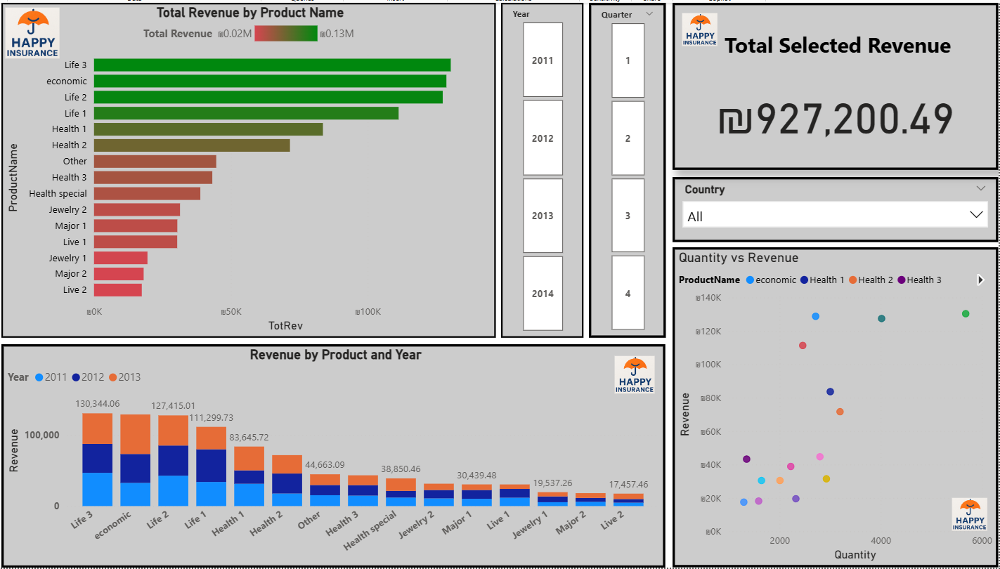
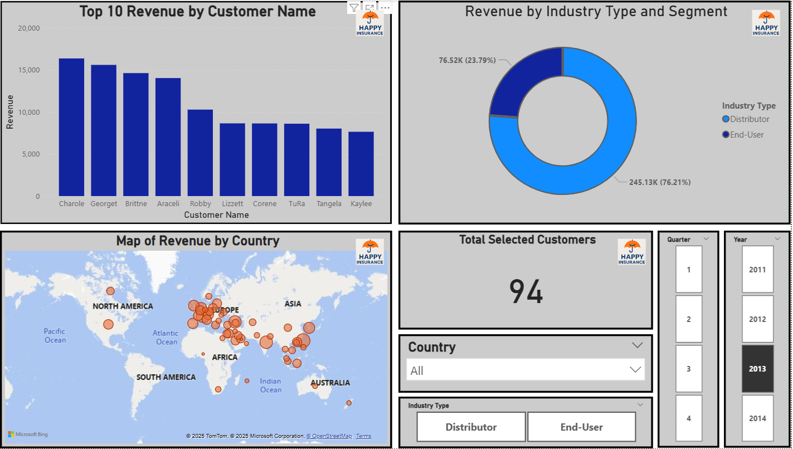
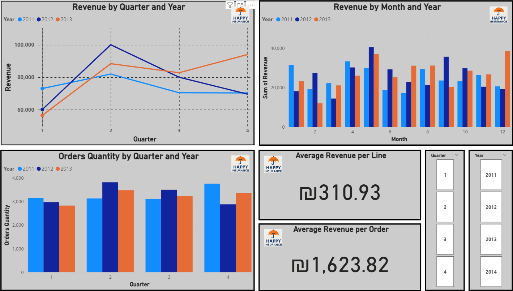
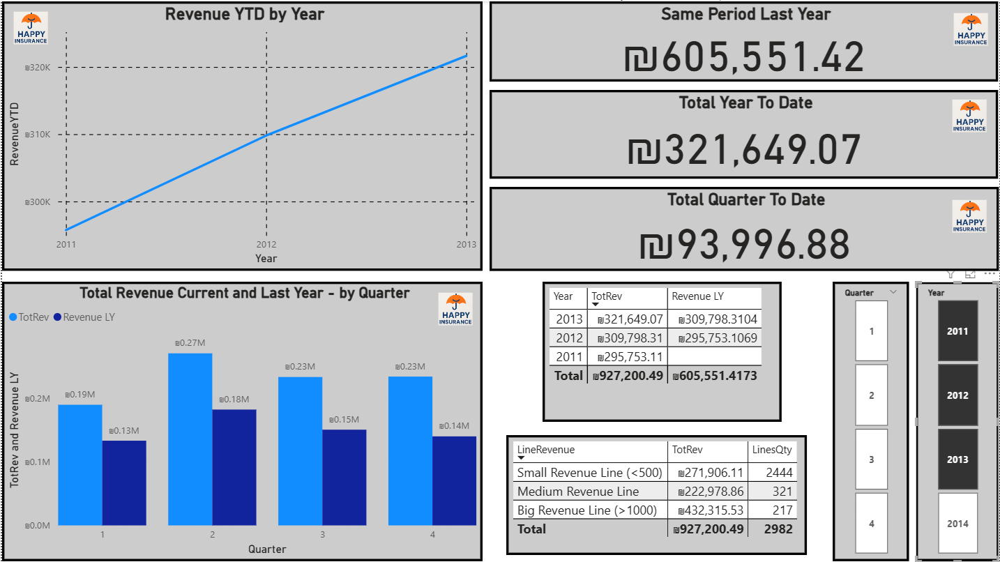
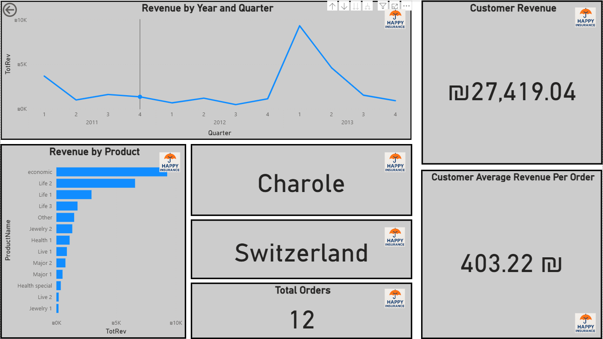

📘 Happy Insurance — Business Intelligence Project

A complete BI solution built using Power BI, Power Pivot, Power Query, and DAX, following the methodology taught in the TCBDA27 Big Data Analysis Program (Technion).

🎯 Project Objective

This project simulates a real-world Business Intelligence workflow by transforming raw operational data from the fictional insurance company Happy Insurance into actionable insights.

The project includes the full BI lifecycle:

Data extraction and cleansing (ETL) in Power Query

Dimensional modeling (Star Schema) in Power Pivot

Tabular modeling with DAX measures

Interactive dashboards in Power BI

Business-driven insights and conclusions

📁 Repository Structure
Data/                     → Data sources (Excel/CSV)
PowerBI/                  → PBIX file + dashboards previews
DAX/                      → DAX measures + DAX Studio queries
Presentation/             → Project slide deck
PowerQuery/               → M scripts (optional)
Documentation/            → Original instructions (optional)

🧩 ETL Process (Power Query)

The ETL pipeline was implemented entirely in Power Query and includes:

Full data cleansing (nulls, duplicates, type corrections)

Standardization of fields and categories

Integration of multiple data sources (CSV + SQL)

Logical corrections in business attributes

Construction of a complete DimDate table

Preparation of clean dimensional tables for the Star Schema

⭐ Dimensional Model — Star Schema

### 📐 Data Model (Star Schema)

The Tabular Model includes:

▶ Fact Table

FactSales (revenue, quantity, unit price, division, region, date)

▶ Dimension Tables

DimCustomer

DimDate

DimDivision

DimRegion

DimProduct

▶ Additional Modeling Work

Correct one-to-many relationships

Calculated Columns where necessary

Calculated table for DimTime (when applicable)

Filtering propagation aligned with BI best practices

📐 DAX Measures

All measures were developed following the project requirements, including:

Required DAX Functions

CALCULATE()

FILTER()

SUMX()

RELATED()

ALL()

TOTALYTD()

TOTALQTD()

TOTALMTD()

SAMEPERIODLASTYEAR()

VAR variables

KPI indicators

Full DAX code is available in:
DAX/AnalysisProject2.dax

📊 Power BI Dashboards

The dashboard suite implements all required Power BI functionalities, including:

Visualizations

Bar & column charts

Slicers

Maps

Tables & Matrix

Scatter charts

Cards & KPI visuals

Gauge

Filters

Visual-level filters

Page-level filters

Report-level filters

Top N filters (e.g., Top 10)

Interaction

Drill Down (3 different techniques)

Drill Through

Custom Tooltip

What-If Parameters

Design

Title & formatting

Custom color palette

Logos / images

Clean layout with consistent styling

### 📊 Dashboard Previews

Here are sample screenshots of the Power BI dashboards:

🔎 Key Business Insights

Examples of insights derived from the model:

Life Insurance is the company’s largest division.

Health Insurance is the fastest-growing division.

In “Life Insurance”, APAC has the highest revenue per unit sold.

For “Health Insurance”, USA is the dominant market.

Unit price for Life Insurance increased 34% from 2011 to 2012.

These insights come directly from the model and reflect the business logic of the dataset.

🎤 Project Presentation

The official slide deck (requirements, methodology, model diagrams, conclusions) is included in:

Presentation/DataModeling.pptx

✔️ Conclusion

This repository demonstrates a full end-to-end BI project:
data ingestion → transformation → modeling → DAX layer → dashboards → business insights.

It reflects industry-level best practices in:

Data modeling

ETL with Power Query

DAX development

Interactive report design

Analytical storytelling
